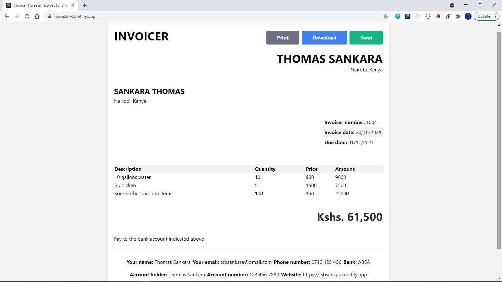

# About Invoicer

#### https://invoicerv2.netlify.app

## Current Features

1. Form to capture yours and your client's data such as full name, email address, physical address, website and your bank account details.
2. Input invoice number, invoice date and due date.
3. Create invoice table - add, edit and remove items from your table.
4. See the total amount of items in the table.
5. Write additional notes to your client such as how to pay, bank details and so on and so forth.
6. Preview your invoice.
7. Print your invoice.

## Todos (additional features to add)

1. Modal to send invoice to client's email - so, add input for client email.
2. Currency converter because yes.
3. Research PDFLayer to convert invoice to pdf for download (and also to send to email).
4. Probably better if I display the form and invoice side by side instead of having to switch every single time to preview.

### Built by [Thomas Sankara](https://tsbsankara.netlify.app)
